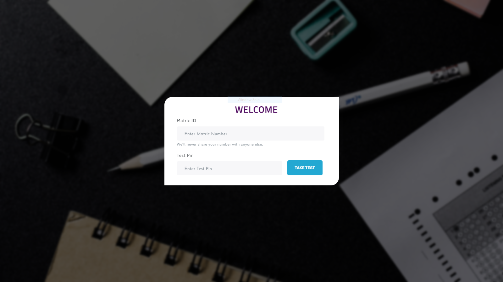

## QuickTest - An Online Quiz Application 

## ...

## Welcome! 👋

An online quiz app built with Redux & React. A study tool built for a friend and his team to practice and prepare for exam.

## Installation and Setup.

For fellow Developer who would like to check the code out and make use of it, use the following Instructions:

- git clone my code files and open it up.
- Download and Install [node](https://nodejs.org/en/) and [mongoDB](https://www.mongodb.com/) if you haven't done that.
- Open up command prompt or Terminal and cd into the Directory😉.
- Run `npm install` in the root and `frontend` directory to install all nodejs dependencies used in this project.
- Create `.env` file and allot `JWT_SECRET`, `TEST_PIN`, `NODE_ENV`, `PORT` and `MONGO_URI` to a value.
- Afterward, run `npm run dev` in the terminal to start both the frontend and backend simultaneously, open ur browser and use `localhost:3000` in the search bar.

> **Note:** To do this, you need quite an understanding on Node,React and JavaScript.

## Usage.

- To take test, Input your matric ID or your name.
- There will be a general test pin for all candidates, input the pin and start test.
- End exam when you are done and view result, Test duration is 45 minutes.
  > **Note:** App available on  [quickcbtest](https://quickcbtest.herokuapp.com/)

## Technology used.

- Bootstrap
- Jquery
- React
- Redux
- Expressjs
- MongoDB
- JWT
- Nodejs

Find it useful?. 😉

**Have fun** 🚀
